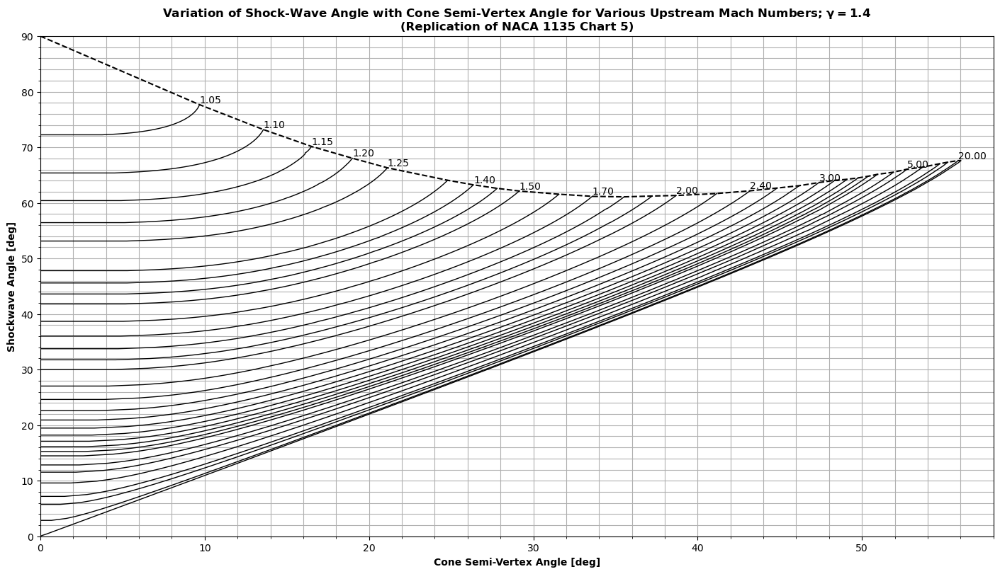

# py_cone_shocks
Cone shock calculations with Python. These can perform post-shock/surface calculations and also returns the flowfield solutions as they vary between shock and surface. NACA chart replication is shown below for verification purposes (see <a href="https://www.nasa.gov/sites/default/files/734673main_Equations-Tables-Charts-CompressibleFlow-Report-1135.pdf">NACA Report 1135</a>).

## NACA Chart 5 (Shockwave Angle vs. Cone Angle)

## NACA Chart 6 (Surface Pressure Coefficient vs. Cone Angle)

## NACA Chart 7 (Surface Mach Parameter vs. Cone Angle)

